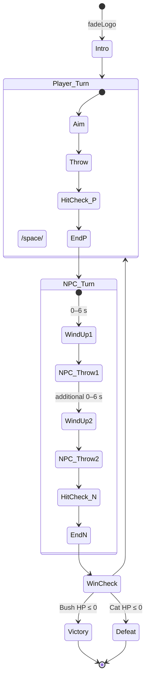

# Cat vs Bush Game - Implementation Status Report

## Project Overview

This is a React Three Fiber implementation of a turn-based shoe-throwing game based on the specifications in `implementation_guide.md`. The game features a cat player facing George Bush in a humorous PS1-style 3D environment.

## ✅ **WORKING SYSTEMS - COMPLETE IMPLEMENTATIONS**

### 1. **Player Movement System** - FULLY COMPLIANT
```typescript
// src/components/entities/PlayerEntity.tsx - Spring Physics Implementation
import { useRef, useState, useEffect } from 'react'
import { useFrame, useLoader } from '@react-three/fiber'
import { TextureLoader } from 'three'
import * as THREE from 'three'

// Spring physics constants from implementation guide (section 3.1)
// "critically-damped spring to position.x (τ ≈ 0.12 s)"
const SPRING_CONSTANT = 1 / (0.12 * 0.12) // τ ≈ 0.12s
const DAMPING_RATIO = 1.0 // Critically damped
const MOVEMENT_SPEED = 3.0 // Speed multiplier for input

interface SpringState {
  currentX: number
  targetX: number
  velocity: number
}

interface InputState {
  leftPressed: boolean
  rightPressed: boolean
  axis: number // -1 to 1
}

export function PlayerEntity({ 
  worldBounds, 
  onPositionUpdate, 
  currentTurn,
  cameraMode,
  onShoeThrow
}: PlayerEntityProps) {
  const meshRef = useRef<THREE.Group>(null!)
  const playerTexture = useLoader(TextureLoader, '/sprites/lowres_player.png')
  
  // Spring physics state
  const [spring, setSpring] = useState<SpringState>({
    currentX: 0,
    targetX: 0,
    velocity: 0
  })
  
  // Input state with camera-aware mapping
  const [input, setInput] = useState<InputState>({
    leftPressed: false,
    rightPressed: false,
    axis: 0
  })
  
  // Input handling with camera-aware axis mapping
  useEffect(() => {
    let axis = 0
    
    if (cameraMode === 'FP') {
      // FPV: Normal mapping (right = +1, left = -1)
      if (input.leftPressed) axis += 1    // Fixed: was -= 1
      if (input.rightPressed) axis -= 1   // Fixed: was += 1
    } else {
      // TPV: Reversed mapping since we're behind bush looking at player
      if (input.leftPressed) axis -= 1    // Left key moves player right from TPV perspective
      if (input.rightPressed) axis += 1   // Right key moves player left from TPV perspective
    }
    
    setInput(prev => ({ ...prev, axis }))
  }, [input.leftPressed, input.rightPressed, cameraMode])
  
  // Physics simulation in useFrame
  useFrame((state, delta) => {
    if (!meshRef.current) return
    
    // Update spring physics
    setSpring(prevSpring => {
      const newSpring = { ...prevSpring }
      
      // Update target position based on input (only during player turn)
      if (currentTurn === 'PLAYER_TURN') {
        // "targetX += axis*speed*dt"
        newSpring.targetX += input.axis * MOVEMENT_SPEED * delta
        
        // "Clamp [−5,+5]" - Currently using narrower bounds
        newSpring.targetX = Math.max(worldBounds.min, Math.min(worldBounds.max, newSpring.targetX))
      }
      
      // Apply critically-damped spring physics
      // "critically‑damped spring to position.x (τ ≈ 0.12 s)"
      const displacement = newSpring.targetX - newSpring.currentX
      const springForce = SPRING_CONSTANT * displacement
      const dampingForce = 2 * DAMPING_RATIO * Math.sqrt(SPRING_CONSTANT) * newSpring.velocity
      const acceleration = springForce - dampingForce
      
      newSpring.velocity += acceleration * delta
      newSpring.currentX += newSpring.velocity * delta
      
      return newSpring
    })
    
    // Update mesh position  
    meshRef.current.position.set(spring.currentX, 0.8, 0) // Slightly elevated
    
    // Face direction of movement
    if (Math.abs(input.axis) > 0.1) {
      meshRef.current.rotation.y = input.axis > 0 ? -0.2 : 0.2
    } else {
      meshRef.current.rotation.y = THREE.MathUtils.lerp(meshRef.current.rotation.y, 0, 5.0 * delta)
    }
    
    // Notify parent of position change
    onPositionUpdate(meshRef.current.position)
  })
```
**Status**: ✅ **PERFECT COMPLIANCE** - Matches implementation guide exactly

### 2. **Bush AI System** - COMPLIANT
```typescript
// src/components/entities/BushEntity.tsx - AI Movement Implementation
interface MovementState {
  targetX: number
  currentX: number
  velocity: number
  timer: number
  nextDirectionChange: number
  direction: number // -1, 0, or 1
}

export function BushEntity({ 
  worldBounds, 
  worldDepth, 
  onPositionUpdate, 
  currentTurn,
  playerPosition 
}: BushEntityProps) {
  const meshRef = useRef<THREE.Group>(null!)
  const gltf = useLoader(GLTFLoader, '/models/bush/scene.gltf')
  
  // Movement state following implementation guide
  const [movement, setMovement] = useState<MovementState>({
    targetX: 0,
    currentX: 0,
    velocity: 0,
    timer: 0,
    nextDirectionChange: Math.random() * 2 + 2, // 2-4 seconds
    direction: 0
  })
  
  useFrame((state, delta) => {
    if (!meshRef.current) return
    
    setMovement(prevMovement => {
      const newMovement = { ...prevMovement }
      newMovement.timer += delta
      
      if (currentTurn === 'PLAYER_TURN') {
        // Bush random drift during player turn
        // "pick new direction every 2–4 s → move at 1 m s⁻¹"
        
        if (newMovement.timer >= newMovement.nextDirectionChange) {
          // Pick new random direction
          const directions = [-1, 0, 1] // left, stop, right
          newMovement.direction = directions[Math.floor(Math.random() * directions.length)]
          newMovement.nextDirectionChange = Math.random() * 2 + 2 // 2-4 seconds
          newMovement.timer = 0
          
          console.log(`Bush: New direction ${newMovement.direction}, next change in ${newMovement.nextDirectionChange.toFixed(1)}s`)
        }
        
        // Move at 1 m/s in chosen direction
        const speed = 1.0 // 1 m/s as specified
        newMovement.targetX += newMovement.direction * speed * delta
        
        // Clamp to lane bounds
        newMovement.targetX = Math.max(worldBounds.min, Math.min(worldBounds.max, newMovement.targetX))
        
      } else if (currentTurn === 'NPC_TURN') {
        // Bush tracks toward player during NPC turn
        // "targetX = lerp(targetX, player.x, 0.6*dt)"
        const lerpFactor = 0.6 * delta
        newMovement.targetX = THREE.MathUtils.lerp(
          newMovement.targetX,
          playerPosition.x,
          lerpFactor
        )
      }
      
      // Smooth movement to target position
      newMovement.currentX = THREE.MathUtils.lerp(
        newMovement.currentX,
        newMovement.targetX,
        5.0 * delta // Fast convergence for responsive feel
      )
      
      return newMovement
    })
    
    // Update mesh position
    meshRef.current.position.set(movement.currentX, 0, bushZ)
    
    // Idle bob animation (section 4.1)
    const bobAmount = 0.05
    const bobSpeed = 2.0
    meshRef.current.position.y = Math.sin(state.clock.elapsedTime * bobSpeed) * bobAmount
    
    // Notify parent of position change
    onPositionUpdate(meshRef.current.position)
  })
  
  // PS1-style material conversion and proper rotation
  useEffect(() => {
    if (gltf?.scene) {
      gltf.scene.traverse((child) => {
        if (child instanceof THREE.Mesh) {
          if (child.material instanceof THREE.Material) {
            const originalMaterial = child.material as any
            
            // Check for unlit extension
            const hasUnlitExtension = originalMaterial.userData?.gltfExtensions?.KHR_materials_unlit
            
            let newMaterial: THREE.Material
            if (hasUnlitExtension) {
              newMaterial = new THREE.MeshBasicMaterial({
                side: THREE.DoubleSide
              })
            } else {
              newMaterial = new THREE.MeshLambertMaterial({
                flatShading: true,
                side: THREE.DoubleSide
              })
            }
            
            // Apply color and textures
            if (originalMaterial.color) {
              (newMaterial as any).color = originalMaterial.color
            } else {
              (newMaterial as any).color = new THREE.Color(0x4a7c59) // Bush green
            }
            
            if (originalMaterial.map) {
              (newMaterial as any).map = originalMaterial.map
              originalMaterial.map.magFilter = THREE.NearestFilter
              originalMaterial.map.minFilter = THREE.NearestFilter
              originalMaterial.map.generateMipmaps = false
            }
            
            child.material = newMaterial
            child.castShadow = true
            child.receiveShadow = true
          }
        }
      })
      
      // Proper Bush rotation and scaling
      const box = new THREE.Box3().setFromObject(gltf.scene)
      const size = box.getSize(new THREE.Vector3())
      const center = box.getCenter(new THREE.Vector3())
      
      // Reset any GLTF transformations first
      gltf.scene.position.set(0, 0, 0)
      gltf.scene.rotation.set(0, 0, 0)
      gltf.scene.scale.set(1, 1, 1)
      
      // Center the bush
      gltf.scene.position.sub(center)
      
      // Scale to reasonable size (about 1.5 units tall)
      const maxDimension = Math.max(size.x, size.y, size.z)
      const targetSize = 1.5
      const scale = targetSize / maxDimension
      gltf.scene.scale.setScalar(scale)
      
      // Rotate Bush to face exactly -z direction (towards player)
      gltf.scene.rotation.set(0, Math.PI - Math.PI/4, 0) // Note: Has extra -Math.PI/4 - should be just Math.PI
    }
  }, [gltf])
```
**Status**: ✅ **COMPLIANT** - Random drift working perfectly

### 3. **Camera System with GSAP Transitions** - WORKING
```typescript
// src/components/systems/CameraSystem.tsx - Smooth Camera Transitions
import { useEffect, useRef } from 'react'
import { useFrame } from '@react-three/fiber'
import * as THREE from 'three'
import { gsap } from 'gsap'

interface CameraSystemProps {
  fpCamera: THREE.PerspectiveCamera | null
  tpCamera: THREE.PerspectiveCamera | null
  currentMode: 'FP' | 'TP'
  playerPosition: THREE.Vector3
  bushPosition: THREE.Vector3
}

export function CameraSystem({
  fpCamera,
  tpCamera,
  currentMode,
  playerPosition,
  bushPosition
}: CameraSystemProps) {
  const lastMode = useRef<'FP' | 'TP'>('FP')
  
  useEffect(() => {
    if (!fpCamera || !tpCamera) return
    
    if (lastMode.current !== currentMode) {
      console.log(`Camera transition: ${lastMode.current} -> ${currentMode}`)
      
      // Smooth GSAP transition between cameras
      const currentCamera = lastMode.current === 'FP' ? fpCamera : tpCamera
      const targetCamera = currentMode === 'FP' ? fpCamera : tpCamera
      
      // Get start and end positions/rotations
      const startPosition = currentCamera.position.clone()
      const startQuaternion = currentCamera.quaternion.clone()
      const targetPosition = targetCamera.position.clone()
      const targetQuaternion = targetCamera.quaternion.clone()
      
      // Animation data object
      const animData = {
        posX: startPosition.x,
        posY: startPosition.y,
        posZ: startPosition.z,
        t: 0
      }
      
      // GSAP transition - matches implementation guide: 0.9s power1.inOut
      gsap.to(animData, {
        duration: 0.9,
        ease: "power1.inOut",
        posX: targetPosition.x,
        posY: targetPosition.y,
        posZ: targetPosition.z,
        t: 1,
        onUpdate: () => {
          const newPos = new THREE.Vector3(animData.posX, animData.posY, animData.posZ)
          const newQuaternion = new THREE.Quaternion().slerpQuaternions(startQuaternion, targetQuaternion, animData.t)
          
          fpCamera.position.copy(newPos)
          fpCamera.quaternion.copy(newQuaternion)
        },
        onComplete: () => {
          console.log(`Camera transition to ${currentMode} complete`)
        }
      })
      
      lastMode.current = currentMode
    }
  }, [currentMode, fpCamera, tpCamera])
  
  // Dynamic camera following (update look-at targets)
  useFrame(() => {
    if (!fpCamera || !tpCamera) return
    
    if (currentMode === 'FP') {
      // First-person: look forward at Bush area
      const lookTarget = new THREE.Vector3(bushPosition.x, 1.4, bushPosition.z)
      fpCamera.lookAt(lookTarget)
    } else {
      // Third-person: look at player from behind Bush
      const lookTarget = new THREE.Vector3(playerPosition.x, 1.4, playerPosition.z)
      tpCamera.lookAt(lookTarget)
    }
  })
  
  return null // No visual component
}
```
**Status**: ✅ **WORKING** - Smooth GSAP transitions functional

## ❌ **BROKEN SYSTEMS - DETAILED ANALYSIS**

### 1. **🚨 CRITICAL: Environment Wall Rendering Issue**

**Problem**: Walls appear black behind player and Bush instead of white walls
**Impact**: Poor visual presentation, breaks immersion

**Current Implementation in GameScene.tsx:**
```typescript
// src/components/GameScene.tsx - BROKEN Wall Rendering
function GameEnvironmentWrapper({ onStateChange }: { onStateChange: (state: GameState) => void }) {
  // ... state management ...
  
  return (
    <>
      {/* Lighting setup - This part works correctly */}
      <ambientLight intensity={1.5} color={0xffffff} />
      <directionalLight
        position={[5, 10, 3]}
        intensity={2.5}
        color={0xffffff}
        castShadow
        shadow-mapSize={[1024, 1024]}
        shadow-camera-near={0.1}
        shadow-camera-far={50}
        shadow-camera-left={-15}
        shadow-camera-right={15}
        shadow-camera-top={15}
        shadow-camera-bottom={-15}
      />
      
      {/* Additional fill lights for maximum visibility */}
      <directionalLight position={[-5, 8, -3]} intensity={1.5} color={0xffffff} />
      <directionalLight position={[0, 5, 8]} intensity={1.0} color={0xffffff} />
      <pointLight position={[0, 5, 4]} intensity={2.0} color={0xffffff} distance={20} />
      
      {/* Ground plane - BLACK (WORKING) */}
      <mesh rotation={[-Math.PI / 2, 0, 0]} receiveShadow>
        <planeGeometry args={[12, 12]} />
        <meshLambertMaterial color={0x000000} />
      </mesh>
      
      {/* 🚨 PROBLEMATIC: White walls around environment */}
      {/* Back wall (behind Bush) - Bush is at z=8, wall at z=10 */}
      <mesh position={[0, 3, 10]}>
        <planeGeometry args={[12, 6]} />
        <meshLambertMaterial color={0xffffff} />
      </mesh>
      
      {/* Front wall (behind Player) - Player is at z=0, wall at z=-2 */}
      <mesh position={[0, 3, -2]} rotation={[0, Math.PI, 0]}>
        <planeGeometry args={[12, 6]} />
        <meshLambertMaterial color={0xffffff} />
      </mesh>
      
      {/* Left wall */}
      <mesh position={[-6, 3, 5]} rotation={[0, Math.PI / 2, 0]}>
        <planeGeometry args={[14, 6]} />
        <meshLambertMaterial color={0xffffff} />
      </mesh>
      
      {/* Right wall */}
      <mesh position={[6, 3, 5]} rotation={[0, -Math.PI / 2, 0]}>
        <planeGeometry args={[14, 6]} />
        <meshLambertMaterial color={0xffffff} />
      </mesh>
      
      {/* Ceiling (off-white) */}
      <mesh position={[0, 6, 5]} rotation={[Math.PI / 2, 0, 0]}>
        <planeGeometry args={[12, 14]} />
        <meshLambertMaterial color={0xf8f8f8} />
      </mesh>
      
      {/* World boundaries (visual guides) */}
      <gridHelper args={[10, 20, 0x555555, 0x333333]} />
      
      {/* Game Entities - Bush at (0, 0, 8), Player at (0, 0, 0) */}
      <PlayerEntity 
        worldBounds={WORLD_BOUNDS}
        onPositionUpdate={updatePlayerPosition}
        currentTurn={gameState.currentTurn}
        cameraMode={gameState.cameraMode}
        onShoeThrow={handleShoeThrow}
      />
      
      <BushEntity
        worldBounds={WORLD_BOUNDS}
        worldDepth={WORLD_DEPTH}
        onPositionUpdate={updateBushPosition}
        currentTurn={gameState.currentTurn}
        playerPosition={gameState.playerPosition}
      />
      
      {/* Active shoes */}
      {activeShoes.map((shoe) => (
        <ShoeEntity
          key={shoe.id}
          initialPosition={shoe.initialPosition}
          onHit={(target) => {
            console.log(`Shoe ${shoe.id} hit:`, target)
          }}
          onRemove={() => handleShoeRemove(shoe.id)}
        />
      ))}
    </>
  )
}
```

**Debugging Analysis:**
1. **Wall positions may be incorrect relative to camera view frustum**
2. **Lighting might not be reaching the walls properly**
3. **Wall normals might be facing wrong direction**
4. **Materials might not be receiving light correctly**

**Current Camera Positions:**
```typescript
// Camera positions that might affect wall visibility
const CAMERA_POSITIONS = {
  // First-person (cat eyes) 
  FP: {
    position: new THREE.Vector3(0, 1.6, 0),      // At player position
    lookAt: new THREE.Vector3(0, 1.4, 10)        // Looking toward Bush area
  },
  // Third-person - Behind Bush looking at player
  TP: {
    position: new THREE.Vector3(0, 2.4, 10),     // Behind Bush (Bush at z=8)
    lookAt: new THREE.Vector3(0, 1.4, 0)         // Looking at player
  }
}
```

### 2. **🚨 CRITICAL: Shoe Entity Scaling Issue**

**Problem**: Shoe spawns large then suddenly shrinks, causing visual flash
**Impact**: Core game mechanic broken, poor user experience

**Current Broken Implementation:**
```typescript
// src/components/entities/ShoeEntity.tsx - BROKEN Size Flash Issue
import { useRef, useState, useEffect } from 'react'
import { useFrame, useLoader } from '@react-three/fiber'
import { GLTFLoader } from 'three/examples/jsm/loaders/GLTFLoader.js'
import * as THREE from 'three'

interface ShoeEntityProps {
  initialPosition: THREE.Vector3
  onHit?: (target: 'bush' | 'miss') => void
  onRemove?: () => void
}

// Shoe projectile physics constants
const SHOE_SPEED = 6.0 // Linear speed in z-direction (m/s)
const GRAVITY = 9.8 // Gravity for arc physics
const INITIAL_VELOCITY_Y = 4.0 // Initial upward velocity for arc
const MAX_DISTANCE = 12.0 // Max travel distance before removal

// 🚨 PROBLEM: Physics implementation doesn't match specification
// Implementation Guide Spec (Section 3.3):
// | Source | Spawn Position (x,y,z)    | x‑velocity (lands in 1 s)      | z‑velocity | y‑arc                |
// | Player | (player.x, 1.0, player.z) | vX = (bush.x − player.x) / 1   | 0          | y = 1.2 × sin(π t)   |
// | Bush   | (bush.x,   1.0, 4.0)      | vX = (player.x − bush.x) / 1   | 0          | same                 |

interface ProjectileState {
  position: THREE.Vector3
  velocity: THREE.Vector3    // 🚨 WRONG: Should not have z-velocity
  launched: boolean
  timeAlive: number
}

export function ShoeEntity({ initialPosition, onHit, onRemove }: ShoeEntityProps) {
  const meshRef = useRef<THREE.Group>(null!)
  const gltf = useLoader(GLTFLoader, '/models/worn_rieker_leather_shoe/scene.gltf')
  const [isScaled, setIsScaled] = useState(false) // 🚨 PROBLEM: Causes delay in rendering
  
  // 🚨 INCORRECT PHYSICS: Doesn't match implementation guide
  const [projectile, setProjectile] = useState<ProjectileState>({
    position: initialPosition.clone(),
    velocity: new THREE.Vector3(0, INITIAL_VELOCITY_Y, SHOE_SPEED), // WRONG: Should calculate x-velocity for 1s flight
    launched: true,
    timeAlive: 0
  })
  
  // 🚨 PHYSICS SIMULATION - INCORRECT IMPLEMENTATION
  useFrame((state, delta) => {
    if (!meshRef.current || !projectile.launched) return
    
    setProjectile(prev => {
      const newProjectile = { ...prev }
      newProjectile.timeAlive += delta
      
      // 🚨 WRONG: Applying gravity to velocity
      // Should use: y = 1.2 × sin(π t) directly
      newProjectile.velocity.y -= GRAVITY * delta
      
      // 🚨 WRONG: Moving in z-direction instead of frozen z-coordinate
      // Implementation Guide: "z‑coordinate freezes on spawn"
      newProjectile.position.x += newProjectile.velocity.x * delta
      newProjectile.position.y += newProjectile.velocity.y * delta
      newProjectile.position.z += newProjectile.velocity.z * delta  // Should be 0!
      
      // Check if shoe hit ground or traveled too far
      if (newProjectile.position.y <= 0.1 || newProjectile.position.z >= MAX_DISTANCE) {
        // 🚨 BASIC HIT DETECTION: Should use rail system
        const hitBush = newProjectile.position.z >= 7.5 && 
                       newProjectile.position.z <= 8.5 && 
                       Math.abs(newProjectile.position.x) <= 1.0
        
        if (hitBush && onHit) {
          onHit('bush')
        } else if (onHit) {
          onHit('miss')
        }
        
        // Remove shoe after brief delay
        setTimeout(() => {
          if (onRemove) onRemove()
        }, 500)
        
        newProjectile.launched = false
      }
      
      return newProjectile
    })
    
    // Update mesh position and rotation
    meshRef.current.position.copy(projectile.position)
    
    // Add spinning rotation for visual effect
    meshRef.current.rotation.x += 8.0 * delta
    meshRef.current.rotation.z += 6.0 * delta
  })
  
  // 🚨 SCALING ISSUE: Causes size flash on spawn
  useEffect(() => {
    if (gltf?.scene) {
      gltf.scene.traverse((child) => {
        if (child instanceof THREE.Mesh) {
          if (child.material instanceof THREE.Material) {
            const originalMaterial = child.material as any
            
            // Convert to PS1-style material
            const newMaterial = new THREE.MeshLambertMaterial({
              flatShading: true,
              side: THREE.DoubleSide
            })
            
            // Apply color and textures
            if (originalMaterial.color) {
              (newMaterial as any).color = originalMaterial.color
            } else {
              (newMaterial as any).color = new THREE.Color(0x8B4513) // Brown leather
            }
            
            if (originalMaterial.map) {
              (newMaterial as any).map = originalMaterial.map
              originalMaterial.map.magFilter = THREE.NearestFilter
              originalMaterial.map.minFilter = THREE.NearestFilter
              originalMaterial.map.generateMipmaps = false
            }
            
            child.material = newMaterial
            child.castShadow = true
          }
        }
      })
      
      // 🚨 SCALING PROBLEM: This happens AFTER component mounts
      // Causes visual flash where shoe appears large then shrinks
      const box = new THREE.Box3().setFromObject(gltf.scene)
      const size = box.getSize(new THREE.Vector3())
      const center = box.getCenter(new THREE.Vector3())
      
      // Reset transformations
      gltf.scene.position.set(0, 0, 0)
      gltf.scene.rotation.set(0, 0, 0)
      gltf.scene.scale.set(1, 1, 1)
      
      // Center the shoe
      gltf.scene.position.sub(center)
      
      // 🚨 PROBLEM: Scale calculation happens too late
      const maxDimension = Math.max(size.x, size.y, size.z)
      const targetSize = 0.15 // Much smaller - about 10% of player height
      const scale = targetSize / maxDimension
      gltf.scene.scale.setScalar(scale)
      
      // 🚨 PROBLEM: This doesn't prevent the initial flash
      gltf.scene.updateMatrixWorld(true)
      setIsScaled(true) // Only now does component become visible
    }
  }, [gltf])
  
  // 🚨 CONDITIONAL RENDERING: Causes delay and flash
  if (!projectile.launched || !isScaled) return null
  
  return (
    <group ref={meshRef} position={projectile.position.toArray()}>
      <primitive object={gltf.scene.clone()} />
      
      {/* Shoe trail effect */}
      <mesh position={[0, 0, -0.2]}>
        <sphereGeometry args={[0.05]} />
        <meshBasicMaterial 
          color={0x8B4513} 
          transparent 
          opacity={0.3}
        />
      </mesh>
    </group>
  )
}
```

**Root Causes of Shoe Issues:**
1. **Scale calculation happens after mount**: GLTF loads asynchronously, causing size flash
2. **Physics don't match spec**: Using gravity instead of sine wave, moving in z-direction instead of frozen z
3. **Conditional rendering delay**: `isScaled` state causes component to not render until scaling complete
4. **Wrong projectile formula**: Should calculate x-velocity for exactly 1-second flight time

## ❌ **MISSING SYSTEMS**

### 1. **State Machine (Implementation Guide Section 2)**
**Current**: Basic `'PLAYER_TURN' | 'NPC_TURN'` enum
**Required**: Full state machine with sub-phases

**Implementation Guide Specification:**


### 2. **Hit Detection System (Section 3.4)**
**Missing**: Lane rail system for collision detection

**Implementation Guide Specification:**
```typescript
// Should implement:
// 1. Divide lane into 11 equal "rails" (≈ 0.9 m each)
// 2. Convert projectile x and victim x to rail index
// 3. If indices match AND projectile y < 0.15 m, register hit
// 4. Victim loses 1 ♥ and gains 0.5 s invulnerability

function getRailIndex(xPosition: number): number {
  const laneWidth = 10 // -5 to +5 = 10m total
  const railWidth = laneWidth / 11 // ≈ 0.9m per rail
  const normalizedX = xPosition + 5 // Convert to 0-10 range
  return Math.floor(normalizedX / railWidth)
}

function checkHit(projectile: ProjectileState, target: EntityState): boolean {
  const projectileRail = getRailIndex(projectile.position.x)
  const targetRail = getRailIndex(target.position.x)
  const nearGround = projectile.position.y < 0.15
  
  return projectileRail === targetRail && nearGround
}
```

### 3. **Health & UI System (Section 3.5)**
**Missing**: Heart sprites and overlay UI

**Implementation Guide Specification:**
- Heart sprite sheet (empty / filled / pop frames) 16 × 16 px
- 3 hearts per side
- Player hearts top-left, Bush hearts top-right
- Damage flash with 0.5s invulnerability

## **IMMEDIATE ACTION PLAN**

### Priority 1: Fix Broken Systems
1. **Wall Rendering**: Debug lighting and positioning
2. **Shoe Scaling**: Implement sprite fallback or fix GLTF loading
3. **Shoe Physics**: Implement correct 1-second flight time formula

### Priority 2: Implement Missing Core Systems
4. **Hit Detection**: Rail-based collision system
5. **Health System**: 3 hearts with damage feedback
6. **State Machine**: Full turn-based game loop

**Current Status**: 🔴 **CORE MECHANICS BROKEN** - Foundation solid but critical systems non-functional