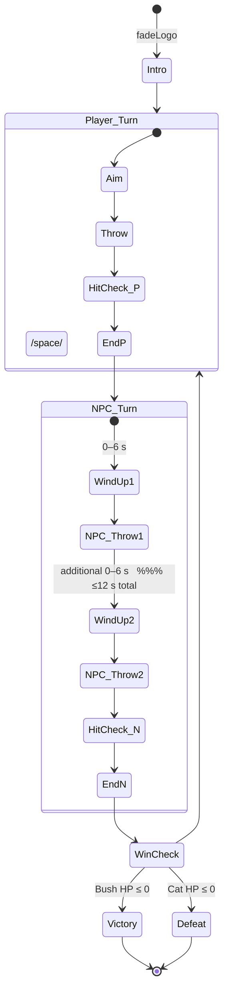

# **Cat vs Bush — Complete Technical Implementation Guide**

---

## 0. Overview

| Key                                                                              | Specification                                                                                                  |
| -------------------------------------------------------------------------------- | -------------------------------------------------------------------------------------------------------------- |
| **Genre**                                                                        | Humorous 1‑v‑1, turn‑based “shoe‑fighter”                                                                      |
| **World**                                                                        | One flat lane \*(x ∈ –5 … +5 m,                                                                                |
| z‑depth ≈ 5 m)\*.  Models never move between turns; only the **camera** changes. |                                                                                                                |
| **Player Turn**                                                                  | First‑person from the cat’s eyes, looking straight at Bush.                                                    |
| **NPC Turn**                                                                     | Pokémon‑style over‑shoulder camera; cat visible lower‑left, Bush centre‑top.                                   |
| **Visual Look**                                                                  | PS1 era: ≤ 200‑tri meshes, 32‑colour textures, aggressive dithering, vertex lighting only.                     |
| **Controls**                                                                     | ←/→ smooth strafe • Space throw shoe • R restart.                                                              |
| **UI**                                                                           | 3 ♥ per side, rendered as sprite overlay (player hearts top‑left, Bush hearts top‑right). No menus or pop‑ups. |
| **Target**                                                                       | Web build ≤ 5 MB, 60 FPS on desktop + modern mobile.                                                           |

---

## 1. High‑Level Goals

1. Deliver a tiny, shareable browser game that parodies the famous shoe‑throwing incident.
2. Embrace a deliberately “crusty” PS1 aesthetic for humour and performance.
3. Keep mechanics minimal so players grasp everything without tutorial text.

---

## 2. Game Loop & State Machine



Each sub‑state owns a `timer`; update with `timer += dt`; reset as specified.

---

## 3. Core Mechanics

### 3.1 Player & Bush Movement

| Actor                  | Behaviour                                                                                                                               |
| ---------------------- | --------------------------------------------------------------------------------------------------------------------------------------- |
| **Player**             | Reads horizontal axis (‑1 … 1).  `targetX += axis*speed*dt`, then critically‑damped spring to `position.x` (τ ≈ 0.12 s). Clamp [‑5,+5]. |
| **Bush – Player Turn** | Random drift: pick new direction every 2–4 s → move at 1 m s⁻¹, clamped to lane bounds.                                                 |
| **Bush – NPC Turn**    | Continuously lerps toward player: `targetX = lerp(targetX, player.x, 0.6*dt)` until just before each throw.                             |

### 3.2 Cameras (geometry unchanged)

```ts
// First‑person (cat eyes)
const CAM_FP = new THREE.PerspectiveCamera(60, aspect, 0.1, 25);
CAM_FP.position.set(0, 1.6, 0);
CAM_FP.lookAt(0, 1.4, 4);

// Over‑shoulder Pokémon‑style
const CAM_OS = CAM_FP.clone();
CAM_OS.position.set(-1.6, 2.4, -2);
CAM_OS.lookAt(0, 1.4, 4);
```

`CameraSystem` tween swaps using GSAP over 0.9 s (`power1.inOut`).  No objects move—only view.

### 3.3 Shoe Projectile

| Source | Spawn Position `(x,y,z)`    | x‑velocity (lands in 1 s)      | z‑velocity | y‑arc                |
| ------ | --------------------------- | ------------------------------ | ---------- | -------------------- |
| Player | `(player.x, 1.0, player.z)` | `vX = (bush.x − player.x) / 1` | 0          | `y = 1.2 × sin(π t)` |
| Bush   | `(bush.x,   1.0, 4.0)`      | `vX = (player.x − bush.x) / 1` | 0          | same                 |

> **Important:** z‑coordinate freezes on spawn.  Sprite billboards (`THREE.SpriteMaterial`) spin 360° s⁻¹.

### 3.4 Hit Detection & Damage

1. Divide lane into 11 equal “rails” (≈ 0.9 m each).
2. On update: convert projectile `x` and victim `x` to rail index; if indices match **and** projectile `y < 0.15 m`, register hit.
3. Victim loses 1 ♥ and gains 0.5 s invulnerability (shader flash).

### 3.5 Health & UI

- Heart sprite sheet (empty / filled / pop frames) 16 × 16 px.
- Drawn in a fixed ortho camera overlay.

### 3.6 NPC AI — Two‑Shoe Routine

| Phase     | Exit Condition                          | Action                            |
| --------- | --------------------------------------- | --------------------------------- |
| Wind‑up 1 | `timer ≥ rand(0,6)`                     | Throw #1, reset `timer = 0`       |
| Wind‑up 2 | `timer ≥ rand(0,6)` **or** total ≥ 12 s | Throw #2                          |
| Tracking  | Each frame before a throw               | `targetX → player.x` via lerp 0.6 |
| End       | After second throw or 12 s              | Pass turn to player               |

---

## 4. Art Direction & Asset Pipeline

### 4.1 Style Bible

- 32‑colour master palette
- Textures ≤ 256 × 256; nearest‑neighbour; no mipmaps
- Models ≤ 200 tris; vertex colours; flat shading
- **Cat:** 2‑D sprite sheet 64 × 64 (idle, strafe L/R, hit)
- **Bush:** 180‑tri mesh + 64 × 64 podium texture; idle bob animation
- **Shoe:** 12‑tri mesh **and** 32 × 32 sprite fallback

### 4.2 Workflow

1. **Blender** → low‑poly → `Export > glTF` (with vertex colours)
2. `npm run gltf-compress` (Draco)
3. **Aseprite** sprites → `Export Sprite Sheet`
4. `spritesheet‑js` packs sheets
5. Assets copied by Vite into `dist/`

---

## 5. Technology Stack & Project Layout

### 5.1 Toolchain

| Category   | Tool                                       |
| ---------- | ------------------------------------------ |
| Editor     | **Cursor** (AI + Git)                      |
| Runtime    | Node 20 LTS                                |
| Bundler    | **Vite**                                   |
| Renderer   | **Three.js** (`@types/three`)              |
| Animations | **GSAP**                                   |
| Utilities  | `spritesheet-js`, `gltf-pipeline`, `draco` |
| QA         | ESLint, Prettier, Vitest                   |
| Deployment | GitHub Pages                               |

### 5.2 Directory Skeleton

```
src/
  core/            Game.ts  StateMachine.ts  Input.ts  UI.ts
  entities/        Cat.ts  Bush.ts  Shoe.ts
  systems/         CameraSystem.ts  ProjectileSystem.ts  NPC_AI.ts  DriftSystem.ts
public/
  sprites/         cat.png  hearts.png  shoe.png
  models/          bush.glb  podium.glb
  textures/        *
```

---

## 6. Development Commands

| Task          | Command                          |
| ------------- | -------------------------------- |
| Start dev     | `npm run dev`                    |
| Build release | `npm run build`                  |
| Deploy demo   | `npm run deploy` (gh‑pages)      |
| Unit tests    | `npm run test`                   |
| Lint / format | `npm run lint && npm run format` |

---

## 7. Milestones & Deliverables

| #                                                                          | Name             | Key Deliverables                                                                                                |
| -------------------------------------------------------------------------- | ---------------- | --------------------------------------------------------------------------------------------------------------- |
| 1                                                                          | Skeleton         | Three.js scene, ground grid, dev server running.                                                                |
| 2                                                                          | Cat Movement     | Cat sprite renders; smooth strafe with bounds; over‑the‑shoulder camera placeholder.                            |
| 3                                                                          | Bush Stand‑in    | Load low‑poly Bush + podium; idle bob animation; Bush drift system during player turn.                          |
| 4                                                                          | Turn Manager     | Full state machine; camera tween between FP ↔ OS; ♥ UI placeholder.                                             |
| 5                                                                          | Throw Core       | Unified `Shoe` class; spawns at current z, arcs, lands in exactly 1 s; lane‑based hit detection; damage system. |
| 6                                                                          | NPC Intelligence | Two‑shoe schedule (0–6 s, then ≤ 12 s); Bush lateral tracking; player invincibility flash.                      |
| 7                                                                          | UI & Polish      | Heart sprites, damage flash, restart key, CRT post‑process shader (optional).                                   |
| 8                                                                          | Content Pass     | Final textures, sound FX (Bfxr), looping chiptune (Bosca Ceoil), logo splash fade‑in.                           |
| Each milestone must conclude with a playable commit and a CHANGELOG entry. |                  |                                                                                                                 |

---

## 8. Testing & QA Checklist

- Shoes land in same z‑plane they spawned.
- Projectile reaches target lane in 1 s (±5 ms).
- Bush drift during player aim does **not** affect trajectory (calculated at throw).
- 60 FPS on Intel HD 620.
- Draw calls ≤ 50; GPU memory ≤ 100 MB.

---

## 9. Performance Targets

- Desktop 60 FPS; mobile ≥ 40 FPS.
- Bundle ≤ 5 MB gzip.
- Loading time ≤ 3 s on 4G.

---

## 10. Future Extensions

- Power‑up (steel‑toe shoe = 2 damage)
- Endless survival mode (escalating shoe speed)
- Online leaderboard via Firebase

---

**End of Guide**

